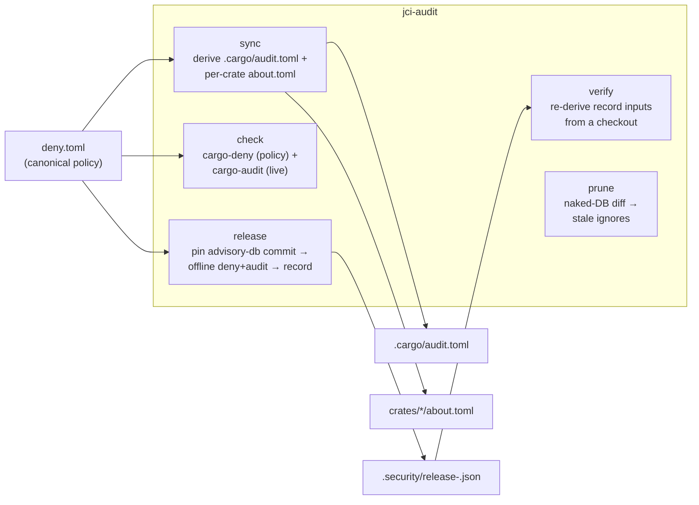

<!--
SPDX-FileCopyrightText: 2026 jerusdp

SPDX-License-Identifier: MIT OR Apache-2.0
-->

# Architecture

A high-level map of how jci-audit is put together. For the detailed design, rationale, and
worked examples, see the [design document](design.md).

## What it does, in one line

Orchestrate `cargo audit` and `cargo deny` per pipeline context — live and blocking on a PR,
pinned and reproducible at release — with `deny.toml` as the single source of truth that
`.cargo/audit.toml` and every crate's `about.toml` are derived from.

## Crate layout

This is a Cargo workspace with a single library-plus-binary crate, `crates/jci-audit`
(`src/lib.rs` → library `jci_audit`, `src/main.rs` → binary `jci-audit`). Keeping the logic in a
library makes it testable independently of the CLI shell, and lets the generated orb's jobs call
the same code paths that `cargo test` exercises directly.

## Pipeline

## Modules (`crates/jci-audit/src/`)

| Module | Responsibility |
|--------|----------------|
| `check.rs` | PR/dev gate: runs `cargo-deny` (policy) and `cargo-audit` (live advisories), aggregates results, never short-circuits on the first failure. Defines the `CommandRunner` trait used to mock subprocess calls in tests. |
| `sync.rs` | Derives `.cargo/audit.toml` and every crate's `about.toml` from `deny.toml`'s canonical advisory-ignore and license policy. Writing is a `toml_edit` **merge**, not a rewrite — hand-authored comments and `.clarify` attribution blocks pass through untouched. `--check` reports drift without writing. |
| `license_scope.rs` | Computes each crate's *own* license-acceptance list by walking `cargo metadata`'s reachable dependency graph (excluding dev-only edges) and evaluating each package's SPDX expression against `deny.toml`'s allow-list — a crate-scoped subset, not the whole workspace policy copied verbatim. |
| `release.rs` | Release gate: locks `cargo-deny`/`cargo-audit` to a pinned `advisory-db` commit for reproducibility, runs a non-blocking live audit, and writes the signed `.security/release-<version>.json` record. |
| `verify.rs` | Re-derives a past release's three recorded inputs (dependency-set digest, policy digest, advisory-db commit) from a real checkout and compares them against the record — answers "did it really pass, under the exceptions in force at the time?" |
| `prune.rs` | Stale-ignore detector: runs the audit tool from outside the workspace (so no local ignore file is discovered) to get the **naked** result, and flags configured ignores that no longer fire. |
| `init.rs` | Scaffolds the standard `deny.toml` policy template plus its derived `.cargo/audit.toml`. |
| `gitops.rs` | Signs and pushes the release record via `pcu` — GPG import/signing and a GitHub App installation token for protected-branch bypass authority, reading only environment-variable *names*. |
| `preflight.rs` | Presence-checks `cargo-audit`/`cargo-deny`/`cargo-about`/bare `cargo` before any subcommand shells out to them, with per-tool install guidance. |
| `diagnostics.rs` | Parses `cargo-deny`'s `warning[code]:` stderr lines into counts, so a captured run still surfaces what needs attention. |

## Subcommands

| Subcommand | Context | Purpose |
|------------|---------|---------|
| `check` | PR / dev gate | Both tools, both blocking, live data. |
| `release --version X` | Release gate | Reproducible offline validation against a pinned advisory-db commit; writes the record. |
| `sync [--check]` | PR + dev | Regenerate (or check drift of) `.cargo/audit.toml` and every `about.toml` from `deny.toml`. |
| `prune [--check]` | PR + scheduled | Detect advisory ignores that no longer fire. |
| `verify` | Audit / retrospective | Re-check a past release's record against a real checkout. |
| `init` | Scaffold | Write the standard `deny.toml` template. |

## External interactions

- **Process execution** — shells out to exactly four fixed binaries: `cargo-audit`,
  `cargo-deny`, `cargo-about`, and bare `cargo` (for `cargo metadata`). Never a caller-supplied
  program — see [assurance-case.md](assurance-case.md).
- **Git & network** — uses `pcu` (itself built on `git2`/libgit2) for GPG-signed commits and
  pushing the release record over HTTPS with a GitHub App installation token.
- **Its own orb** — the project dogfoods `gen-circleci-orb` to generate the orb published from
  this repository (`orb/`), and jci-audit's own CI runs `jci-audit check`/`release` on itself.

## Key design properties

- **`deny.toml` is the single source of truth.** Both derived files (`.cargo/audit.toml`,
  `about.toml`) are regenerated from it, never maintained by hand in parallel — the failure mode
  that motivated the project (issue #35: the two had silently drifted).
- **Reproducible, not just passing.** A release's validation is locked to a specific advisory-db
  commit and can be independently re-derived later (`verify`), rather than a one-time assertion.
- **Fail loud, not silent.** Missing tools (`preflight`), drifted derived files (`sync --check`),
  and stale ignores (`prune`) are all hard, actionable failures.

For deeper detail — the merge algorithm for derived files, the reproducibility mechanics, and the
release-record schema — see the [design document](design.md).
