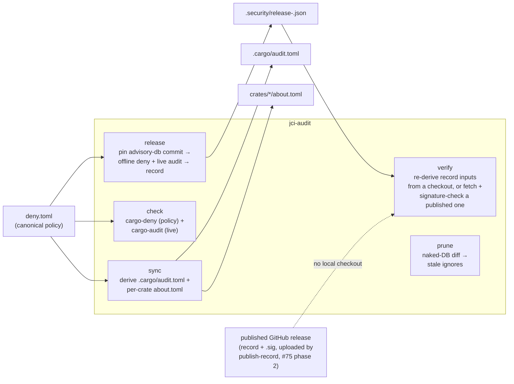

<!--
SPDX-FileCopyrightText: 2026 jerusdp

SPDX-License-Identifier: MIT OR Apache-2.0
-->

# Architecture

A high-level map of how jci-audit is put together. For the detailed design, rationale, and
worked examples, see the [design document](design.md).

## What it does, in one line

Orchestrate `cargo audit` and `cargo deny` per pipeline context — live and blocking on a PR,
pinned and reproducible at release — with `deny.toml` as the single source of truth that
`.cargo/audit.toml` and every crate's `about.toml` are derived from.

## Crate layout

This is a Cargo workspace with a single **bin-only** crate, `crates/jci-audit`
(`src/main.rs` → binary `jci-audit`, declaring the crate's modules; `src/cli.rs` → `Cli` +
`Commands` + dispatch). Deliberately no `[lib]` target — nothing depends on `jci_audit` as a
library, and publishing to crates.io shouldn't make one importable
([#90](https://github.com/jerus-org/jci-audit/issues/90)). Splitting the logic into modules
still makes each one independently unit-testable (`cargo test` compiles and runs a bin
crate's `#[cfg(test)]` modules the same way it would a lib's); the generated orb's jobs don't
link any of this code either way — they shell out to the compiled `jci-audit` binary, same as
a human running it.

## Pipeline

```mermaid
flowchart LR
    DENY["deny.toml\n(canonical policy)"] --> SYNC
    DENY --> CHECK
    DENY --> RELEASE
    subgraph "jci-audit"
        SYNC["sync\nderive .cargo/audit.toml +\nper-crate about.toml"]
        CHECK["check\ncargo-deny (policy) +\ncargo-audit (live)"]
        RELEASE["release\npin advisory-db commit →\noffline deny + live audit → record"]
        VERIFY["verify\nre-derive record inputs\nfrom a checkout, or fetch +\nsignature-check a published one"]
        PRUNE["prune\nnaked-DB diff →\nstale ignores"]
    end
    SYNC --> AUDITTOML[".cargo/audit.toml"]
    SYNC --> ABOUTTOML["crates/*/about.toml"]
    RELEASE --> RECORD[".security/release-<version>.json"]
    RECORD --> VERIFY
    RELEASEASSET["published GitHub release\n(record + .sig, uploaded by\npublish-record, #75 phase 2)"] -.->|no local checkout| VERIFY
```

## Modules (`crates/jci-audit/src/`)

| Module | Responsibility |
|--------|----------------|
| `main.rs` | Crate doc, module declarations, tracing setup. |
| `cli.rs` | `Cli` + `Commands` argument parsing and dispatch to each subcommand's `*_with` entry point. |
| `check.rs` | PR/dev gate: runs `cargo-deny` (policy), `cargo-audit` (live advisories), the `about.toml`/`deny.toml` drift check, and the `cargo-about` license-policy resolution check — all always-on — plus an opt-in fifth check (`--deny-stale-notices`) comparing the rendered `THIRD-PARTY-LICENSES.md` license set against the committed one: fails only if the set grew (a license substituted or added), warns on any other drift. Aggregates all results, never short-circuits on the first failure. Defines the `CommandRunner` trait used to mock subprocess calls in tests. |
| `sync.rs` | Derives `.cargo/audit.toml` and every crate's `about.toml` from `deny.toml`'s canonical advisory-ignore and license policy. Writing is a `toml_edit` **merge**, not a rewrite — hand-authored comments and `.clarify` attribution blocks pass through untouched. `--check` reports drift without writing. |
| `license_scope.rs` | Computes each crate's *own* license-acceptance list by walking `cargo metadata`'s reachable dependency graph (excluding dev-only edges) and evaluating each package's SPDX expression against `deny.toml`'s allow-list — a crate-scoped subset, not the whole workspace policy copied verbatim. |
| `exceptions.rs` | Visibility for cargo-deny's native `[[bans.skip]]` exceptions — which are genuinely in force vs stale. |
| `release.rs` | Release gate: locks `cargo-deny` to a pinned `advisory-db` commit and runs it offline for reproducibility; `cargo-audit` runs live as a non-blocking currency check, not a second pinned pass; writes `.security/release-<version>.json` locally (see [#75](https://github.com/jerus-org/jci-audit/issues/75) for how it's distributed). |
| `verify.rs` | Re-derives a past release's three recorded inputs (dependency-set digest, policy digest, advisory-db commit) from a real checkout and compares them against the record — answers "did it really pass, under the exceptions in force at the time?" |
| `remote.rs` | `verify`'s no-checkout fallback when no local record exists: downloads the record and its signature from the **published** GitHub release via `pcu-release-assets`, finds the pubkey that signed it from one of two ordered `PubkeySource`s (`Cargo.toml` at the release tag, then the release's own `.pub` asset), and checks the minisign signature (shelling to `rsign verify`) before trusting the record's content. Does not re-run the gate — see [assurance-case.md](assurance-case.md) T6. |
| `publish_record.rs` | `publish-record` (#75 phase 2): uploads a release's record and its `.sig` as named GitHub release assets, so `remote.rs` has something to fetch. |
| `prune.rs` | Stale-ignore detector: runs the audit tool from outside the workspace (so no local ignore file is discovered) to get the **naked** result, and flags configured ignores that no longer fire. |
| `init.rs` | Scaffolds the standard `deny.toml` policy template plus its derived `.cargo/audit.toml`. |
| `wire_ci.rs` | `wire-ci`/`check-ci-wiring`: wires the published `jerus-org/jci-audit` orb job(s) into a consumer's `.circleci/config.yml`, and checks whether that wiring has drifted. |
| `preflight.rs` | Presence-checks `cargo-audit`/`cargo-deny`/`cargo-about`/bare `cargo`/`rsign` before any subcommand shells out to them, with per-tool install guidance. |
| `runtime.rs` | The single-thread tokio runtime idiom shared by every synchronous-facing async caller (`remote.rs`, `publish_record.rs`), so each reuses one runtime instead of paying setup/teardown per call. |
| `diagnostics.rs` | Parses `cargo-deny`'s `warning[code]:` stderr lines into counts, so a captured run still surfaces what needs attention. |
| `fs_atomic.rs` | Replaces a file without leaving a partial one on disk if the process is interrupted mid-write. |

## Subcommands

| Subcommand | Context | Purpose |
|------------|---------|---------|
| `check` | PR / dev gate | cargo-deny + cargo-audit, the about.toml drift check, and the cargo-about resolution check, all blocking, live data; the notices check when `--deny-stale-notices` is set. |
| `release-prep X` | Release gate | Reproducible offline validation against a pinned advisory-db commit; writes the record locally. |
| `sync [--check]` | PR + dev | Regenerate (or check drift of) `.cargo/audit.toml` and every `about.toml` from `deny.toml`. |
| `prune [--check]` | PR + scheduled | Detect advisory ignores that no longer fire. |
| `verify` | Audit / retrospective | Re-check a past release's record against a real checkout, or — with no checkout — fetch and signature-check the published release's record instead. |
| `init` | Scaffold | Write the standard `deny.toml` template. |
| `wire-ci` | Scaffold / dev | Wire the published orb job(s) into a consumer's `.circleci/config.yml`. |
| `check-ci-wiring [--check]` | PR + dev | Detect drift between `wire-ci`'s managed CI region and what it would generate now. |
| `publish-record` | Release gate | Upload a release's record and signature as GitHub release assets, for `verify`'s remote path to fetch. |

## External interactions

- **Process execution** — shells out to exactly five fixed binaries: `cargo-audit`,
  `cargo-deny`, `cargo-about`, bare `cargo` (for `cargo metadata`), and `rsign` (signature
  verification, `verify`'s remote path only). Never a caller-supplied program — see
  [assurance-case.md](assurance-case.md).
- **Git** — none. `verify`'s remote path needs no checkout at all, by design.
- **Network** — `verify`'s remote path (no local record present, takes `--owner`/`--repo`/
  `--tag-prefix` to name the release — jerus-org/jci-audit#121) makes outbound HTTPS calls of
  jci-audit's own: fetching the record and its signature as named assets from a **published**
  GitHub release via `pcu-release-assets` (REST + GraphQL, authenticated), and — for the pubkey —
  either the pubkey's own release asset (tried first) or a direct authenticated fetch of the
  release tag's `Cargo.toml`. Every other subcommand, and `verify` when a local record exists,
  makes no network calls of its own — see [assurance-case.md](assurance-case.md) §3/§7.
- **Its own orb** — the project dogfoods `gen-circleci-orb` to generate the orb published from
  this repository (`orb/`), and jci-audit's own CI runs `jci-audit check`/`release-prep` on itself.

## Key design properties

- **`deny.toml` is the single source of truth.** Both derived files (`.cargo/audit.toml`,
  `about.toml`) are regenerated from it, never maintained by hand in parallel — the failure mode
  that motivated the project (issue #35: the two had silently drifted).
- **Reproducible, not just passing.** A release's validation is locked to a specific advisory-db
  commit and can be independently re-derived later (`verify`), rather than a one-time assertion.
- **Fail loud, not silent.** Missing tools (`preflight`), drifted derived files (`sync --check`),
  and stale ignores (`prune`) are all hard, actionable failures.

For deeper detail — the merge algorithm for derived files, the reproducibility mechanics, and the
release-record schema — see the [design document](design.md).
