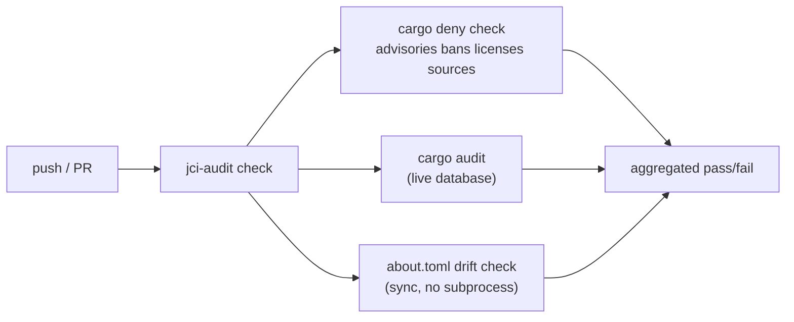
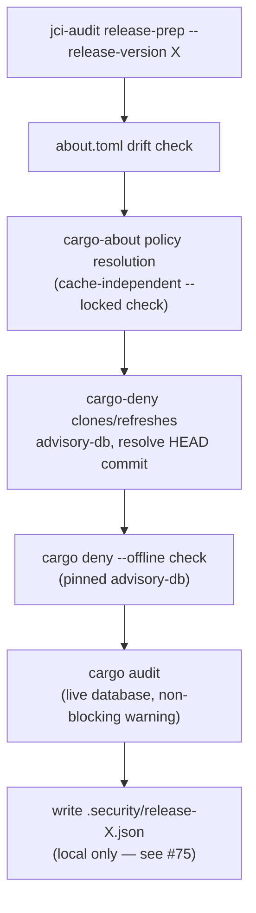
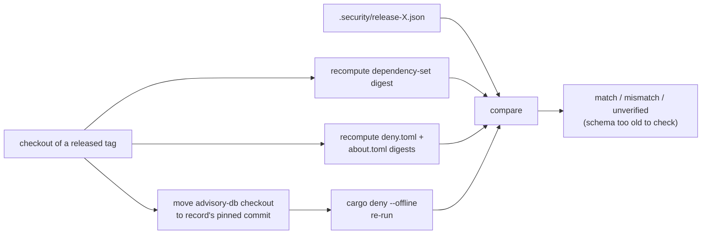

<!--
SPDX-FileCopyrightText: 2026 jerusdp

SPDX-License-Identifier: MIT OR Apache-2.0
-->

# jci-audit — Design Document

> Status: **DRAFT** — design decisions recorded; roadmap items deferred.

---

## 1. Purpose

`jci-audit` is a context-aware security gate for Rust projects. It orchestrates two tools with
complementary strengths — `cargo audit` (fresh, live RustSec advisories) and `cargo deny` (policy
enforcement with file-based, justified ignores) — using each for what it does best, rather than
reimplementing either. It runs each tool differently depending on pipeline context: both blocking
and live on a pull request; at release, `cargo-deny` locks to a pinned, offline advisory-db
commit for reproducibility, while `cargo-audit` keeps running live as a non-blocking currency
check (see §5.1).

### 1.1 The problem it replaces

Before jci-audit, advisory ignores and license policy were commonly duplicated by hand across
`deny.toml`, `.cargo/audit.toml`, and ad-hoc CI `--ignore` flags — three places that can (and did)
drift out of sync. Release validation ran against whatever the live advisory database happened to
say at build time, which is not reproducible: the same commit could pass today and fail tomorrow
as new advisories are published, with no record of what was actually checked.

### 1.2 The core idea

**`deny.toml` is the single canonical source of policy.** Everything else that needs to express
that policy in another tool's format — `.cargo/audit.toml`'s ignore list, each crate's
`about.toml` license-acceptance list — is *derived* from it by `jci-audit sync`, not maintained in
parallel by hand. And **release validation is reproducible**: it locks to a specific advisory-db
commit, records exactly what was checked, and that record can be independently re-derived and
compared later (`jci-audit verify`).

---

## 2. Motivation

Two real incidents drove the design, both instances of the same failure mode — two files stating
one policy by hand, silently drifting apart:

- An advisory accepted in `deny.toml` was absent from `.cargo/audit.toml`, so `cargo audit` still
  flagged it in CI after the team had already decided to accept the risk.
- A release aborted because `deny.toml` had accepted three crates' licenses that `about.toml`
  hadn't (issue #35) — the license-notices side of the same problem, discovered only when
  `cargo-about` refused to resolve at release time.

`jci-audit sync` generalizes the fix: whichever file expresses the same policy in a different
tool's format is derived, never hand-maintained twice.

---

## 3. High-Level Flow

### 3.1 PR / dev gate



Both tool results and the drift check are aggregated — a failure in one does not hide the others.

### 3.2 Release gate



Both drift/policy checks run **before** the advisory-db refresh — the "catch it before the
expensive part" pattern this org uses elsewhere for version calculation.

### 3.3 Verify (retrospective)



---

## 4. The `sync` derivation

### 4.1 `.cargo/audit.toml`

Straightforward: `extract_ignores` reads `deny.toml`'s `[advisories].ignore` array via
`toml_edit`, and `render_audit_toml` writes the equivalent `[advisories] ignore = [...]` structure
to `.cargo/audit.toml`. This file has no other hand-authored content, so it is a full render, not
a merge.

### 4.2 `about.toml` — a per-crate, SPDX-aware derivation

`about.toml` is different in two ways `.cargo/audit.toml` is not:

1. **It is crate-level in a workspace that may hold more than one crate.** Each crate's
   `about.toml` must reflect only the licenses *that crate's own dependency graph* actually
   carries — not the full workspace `deny.toml` allow-list copied verbatim into every crate. A
   crate that drops or changes a dependency such that a license family is no longer in use must
   not keep asserting it is present.
2. **It carries hand-authored content** (`.clarify` attribution pins, comments) that has no
   `deny.toml` equivalent and must survive a sync untouched.

**Algorithm** (`license_scope::scope_for_crate`), for each `crates/*/` directory that contains an
`about.toml`:

1. Run `cargo metadata --manifest-path crates/X/Cargo.toml --format-version 1 --all-features` in
   the crate's own directory. `--all-features` matches this org's convention for anything
   correctness-critical: a dependency gated behind an optional feature still carries a license
   obligation for any consumer who enables that feature.
2. Compute the package-id set reachable from `resolve.root` by walking `resolve.nodes[].deps`,
   excluding an edge only when *every* entry in its `dep_kinds` is `"dev"` — a `null`/normal or
   `"build"` kind keeps the edge, since both ship.
3. For each reachable package's `license` SPDX expression, parse it with `spdx::Expression::parse`
   (the same crate `cargo-deny` uses internally) and test it against `deny.toml`'s
   `[licenses].allow` set. The union of allow-list identifiers that satisfy any reachable
   package's expression is that crate's precise `accepted` list — a subset of the full workspace
   allow-list, not the whole thing.
4. For `[[licenses.exceptions]]`, include an exception crate's `accepted` override in crate X's
   `about.toml` only if that exception's crate name is among the reachable package names from
   step 2 — pure name-membership, since exceptions are already keyed by exact crate name.
5. A reachable package whose expression satisfies neither the allow-list nor an applicable
   exception is not this derivation's problem: `cargo-deny check licenses` already enforces that
   separately. `sync` only derives what to *write* for what already passes policy.

**Writing is a merge** (`sync::merge_about_toml`, via `toml_edit::DocumentMut`), not a rewrite: the
top-level `accepted` array is set to the crate-scoped list; each qualifying exception's table gets
its `accepted` key set; and for every top-level table already in the document, if its `accepted`
key's crate name no longer qualifies, only that key is removed (the table itself is dropped only
if nothing else — e.g. no `.clarify` subtable — remains under it). Comments, `.clarify` blocks, and
`ignore-dev-dependencies` pass through untouched.

---

## 5. Reproducibility: the release record

### 5.1 Why reproducibility needs a pin, not just a pass

Running `cargo deny`/`cargo audit` against the live advisory-db at release time answers "did this
pass *right now*?" — a question whose answer can change tomorrow as new advisories publish,
without the release itself changing. That is not useful as a durable record. jci-audit instead:

1. Lets `cargo-deny` clone/refresh its own advisory-db checkout under a discoverable
   `advisory-db-<hash>` directory.
2. Reads that checkout's current commit (`git rev-parse HEAD` inside it) — this becomes the
   **pinned** commit for the release.
3. Overrides `[advisories].db-path` in a **derived** `deny.toml` (via `toml_edit`, leaving every
   other setting untouched) to point at that checkout, and runs `cargo deny --offline` and
   `cargo audit --db <path> --no-fetch` against it — no network fetch mid-validation.
4. Separately runs a **live** `cargo audit` as a non-blocking warning, so newly published
   advisories are visible without blocking the release on them.

### 5.2 Record schema (`schema_version: 4`)

```json
{
  "schema_version": 4,
  "version": "0.0.7",
  "advisory_db": { "commit": "<pinned commit sha>" },
  "tools": { "cargo_deny": "cargo-deny 0.20.2", "cargo_audit": "cargo-audit 0.22.0" },
  "lockfile": { "dependencies_sha256": "<digest of the EXTERNAL dependency set>" },
  "policy": {
    "deny_toml_sha256": "<digest of deny.toml>",
    "about_toml_sha256": "<digest of the about.toml policy files, or null>"
  },
  "checks": { "deny": { "passed": true, "checks": ["advisories", "bans", "licenses", "sources"] } }
}
```

Design notes:

- **`lockfile.dependencies_sha256` digests the external dependency set, not the raw
  `Cargo.lock` file.** `cargo-release` rewrites the crate's own version in `Cargo.lock` as part of
  the release commit, so a raw-file digest would not survive the release it is meant to describe.
- **`policy.about_toml_sha256` digests the policy *files*, not the rendered
  `THIRD-PARTY-LICENSES.md`.** `cargo-about` resolves license text partly from files extracted into
  the local cargo registry cache, so identical inputs render different bytes across cache states —
  a measured 208-line diff, cold vs warm, same commit and lockfile. Digesting the rendered output
  would make `verify` unable to reproduce it. It is also not yet in final form when `release-prep` runs,
  since `THIRD-PARTY-LICENSES.md` regeneration happens later, in `cargo-release`'s own
  `release-hook.sh`.
- **`about_toml_sha256` is `null` on schema versions before 4** (and on a workspace with no
  `about.toml` at all) — `verify` treats an absent digest as "unverified," not a mismatch, so old
  records stay valid rather than failing retroactively.
- **No timestamps, no live-audit results** in the record — both would break byte-identical re-runs
  of `build_record` for the same inputs. `serde_json`'s map serialization keeps key order stable.

### 5.3 `verify`: closing the loop

`jci-audit verify` answers the auditor's question — *did it really pass, under the exceptions
documented at the time?* — by reconstructing the record's three inputs from a real checkout of the
released tag and comparing:

1. **Dependency set** — recompute `dependency_set_digest` from the checked-out `Cargo.lock` and
   compare to `lockfile.dependencies_sha256`.
2. **Policy** — recompute the `deny.toml` (and, schema ≥4, `about.toml`) digests and compare to
   `policy.*_sha256`. Schema-1 records predate the `deny.toml` digest entirely and are reported as
   trusted-from-git-history rather than falsely implying a check that could not run.
3. **Advisory snapshot** — move the local advisory-db checkout to `advisory_db.commit` and re-run
   `cargo deny --offline`, so it cannot fetch and drift mid-verification.

A missing/null field on an old-schema record is reported as **unverified**, never silently skipped
or treated as a mismatch — the report says plainly how much assurance it actually has.

### 5.4 Verifying without a checkout

`jci-audit verify` tries the local record first (`.security/release-<VERSION>.json`); when it is
absent, it falls back to `src/remote.rs` instead of erroring — the auditor's no-clone path
[#75](https://github.com/jerus-org/jci-audit/issues/75) phase 3 exists for. This is a different,
narrower check than §5.3, not the same one run against fetched bytes:

1. Fetch `release-<VERSION>.json` and its `.sig` from the **published** release for the tag
   (`pcu-release-assets::ReleaseAssetClient::download_release_asset` — published-only by
   construction; it has no method that would read a draft, so there is no runtime flag to get
   wrong).
2. Find the pubkey that signed it from an ordered list of `PubkeySource`s — `cli.rs::
   run_verify_remote` tries `ManifestPubkeySource` (the release tag's raw `Cargo.toml`, read for
   `[package.metadata.binstall.signing].pubkey`) before `AssetPubkeySource` (the record's own
   `.pub` release asset, parsed for the bare key). Manifest first because — until #75's
   asset-upload CI step ships — it's the only one with real data for any actual release at all,
   **not** because it's an independently stronger guarantee: in jci-audit's own pipeline both
   sources currently trace back to the same CI job and credentials (T9 of
   `docs/assurance-case.md` has the full, honest accounting).
3. Check the record's minisign signature against that pubkey, by shelling to `rsign verify`
   (`preflight::Tool::Rsign`) — not by linking a crypto crate.
4. On a valid signature, report the record's attested content (advisory-db commit, recorded
   verdict) — but **do not re-run `cargo-deny`**: that needs the checked-out `Cargo.lock` and
   `deny.toml` a bare directory doesn't have. `RemoteVerifyOutcome::unchecked` says so explicitly,
   naming what a local checkout would additionally let `verify` prove.

A failing signature check is a hard `Err`, not a reported mismatch — unlike §5.3, where a mismatch
is still informative (the checkout state differs from the record, but the record itself was
already trusted from the CI pipeline that wrote it). Here the record's authenticity *is* the
question, so a bad signature means there is nothing left to report.

---

## 6. Distributing the record

`jci-audit release-prep` writes the record to `.security/release-<VERSION>.json` in the working
directory and stops there — it is not committed to git. Earlier versions committed and
GPG-signed it as a commit ancestor of the release tag, specifically to satisfy `cargo-release`'s
refusal to start on a dirty tree; that dependency is gone now, since the record path is
`.gitignore`'d and so never dirties the tree in the first place.

This changed for two reasons, from real operating experience rather than a hypothetical: a
`.security/*.json` file lands on every release — including every minor release during a busy
development stretch — accumulating in the repository (and its history) indefinitely, most of
which has little standalone value once superseded; and an auditor validating one specific release
had to clone the whole (and growing) repository just to fetch that release's record, when the
tools and data needed to validate a release should come from the release itself, the same place
the crate, tarball, and their signatures already come from.

Distribution as a signed release asset — alongside the crate's other signed artifacts — is
tracked in [jerus-org/jci-audit#75](https://github.com/jerus-org/jci-audit/issues/75); this is a
phased rollout. §5.4 describes the *consumer* of that asset (`verify`'s remote fetch path), which
has landed. Phase 2 is the *producer* — CI uploading the record and its signature to the release
before it is published — and there are two ways to do it, per PR review on #105/#75: a private key
must never cross a job boundary, encrypted or not, so a consumer with no equivalent facility of its
own needs a self-contained alternative rather than being pointed at jci-audit's own
toolkit-integrated path.

- **`jci-audit publish-record`** (and its matching generated orb job) is the self-contained path:
  in one process it generates a one-use minisign keypair, signs an already-written record, uploads
  the record/`.sig`/`.pub` to the named release, and (with `--publish`) un-drafts it — the key is
  generated, used, and discarded inside that single call, never passed to or from another step.
  It takes an explicit `--record-path` because `release-prep` and this command commonly run in
  separate CI jobs: the record travels via an attached workspace, landing at whatever
  `workspace_root` names, not inside this job's own fresh `checkout`. This path is done and usable
  by any orb consumer today.
- jci-audit's **own** pipeline does not use that path — it already depends on circleci-toolkit for
  everything else, so it instead reuses the same ephemeral key that already signs the binary
  tarball, for a stronger, crates.io-anchored trust chain (see `docs/RELEASING.md`). That needs two
  small, purpose-agnostic hooks in circleci-toolkit's `release_crate` job (merged,
  digital-prstv/circleci-toolkit#533) to actually release before `.circleci/release.yml` can be
  wired to use them — still pending.

Until jci-audit's own pipeline is wired, `jci-audit release-prep` still gates every release exactly
as before — a failing run still blocks the release — but there is no asset yet for `verify`'s
remote path to fetch against jci-audit's own releases, so it will error with "no such asset" until
that wiring lands.

---

## 7. Preflight: failing loud on a missing tool

A tool whose purpose is detecting missing security coverage must itself detect the absence of the
binaries it depends on — silently no-op-ing on a missing `cargo-deny` would be the worst possible
failure mode for a security gate. Every subcommand that shells out calls
`preflight::ensure_available` first, naming exactly which of the five fixed tools
(`cargo-audit`, `cargo-deny`, `cargo-about`, bare `cargo`, `rsign`) is missing and how to install
it — `cargo binstall <tool>` for `cargo-audit`/`cargo-deny`/`cargo-about`, `cargo binstall rsign2`
for `rsign` (binary name differs from its crate), rustup for bare `cargo` (not
`cargo`-installable, since it doesn't yet exist).

---

## 8. Future work

- **Per-crate release ordering** ([#62](https://github.com/jerus-org/jci-audit/issues/62)) — let a
  multi-crate workspace choose release order so a dependent crate releases against its
  dependency's latest version, mirroring `pcu`'s pattern.
- **Scoped `ignore-build-dependencies`/`ignore-transitive-dependencies`**
  ([#63](https://github.com/jerus-org/jci-audit/issues/63)) — `license_scope` currently always
  includes build dependencies; it should honour `about.toml`'s own settings.
- **Accepted-warnings recording at release time** ([#49](https://github.com/jerus-org/jci-audit/issues/49)).
- See [ROADMAP.md](../ROADMAP.md) for the full near/medium/long-term view.
